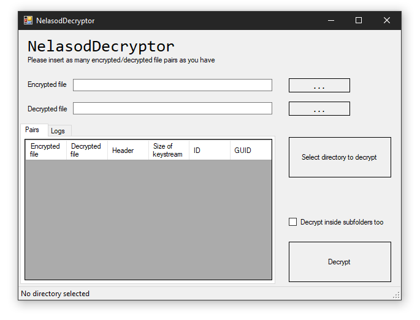

# NelasodRecover
Recover files encrypted by Nelasod with plaintext/ciphertext pairs

Go to **release** to download the compiled binary.

Made with Windows Forms C#

Made this tool while investigating an external HDD that was encrypted with Nelasod, without having the malware to analyze. What I found was that the virus produced an unique keystream for each file based on the first 5 byes, and then xors this keystream with the original file (leaving the first 5 bytes intact). 

This means that, we can recover all the files that start with the same 5 bytes if we have just one original file of that type and the encrypted file.

Useful for binary file types that have a fixed header. Not so much for .txt files
